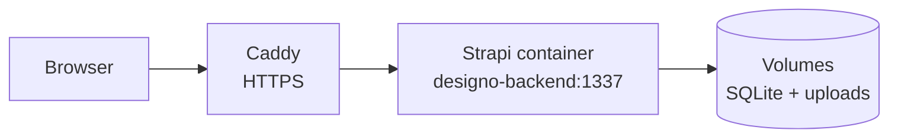

# Designo Backend

Headless CMS and REST API for the Designo agency website, built with **Strapi 4.20** and
TypeScript. It stores the pages, navigation, labels and contact details that the
[Next.js frontend](https://github.com/DeveloperMajd/designo-frontend) renders, and it
handles the contact form.

|  |  |
| --- | --- |
| API | <https://api.designo.developermajd.com/api/pages> |
| Website | <https://designo.developermajd.com> |
| Project overview | [DeveloperMajd/designo](https://github.com/DeveloperMajd/designo) |

## Content model

| Type | Kind | Purpose |
| --- | --- | --- |
| **Page** | collection | A slug, a title and a *dynamic zone*: an ordered list of reusable sections (banners, project grids, info highlights, locations, contact form, ...). The frontend maps each section to a React component, so editors can build and reorder pages without a code change. |
| **Label** | collection | Small pieces of interface copy (for example "Contact us"). |
| **Contact** | single | Address, phone, email and social links shown in the footer. |
| **Menus** | plugin | Editable navigation, via `strapi-plugin-menus`. |

## API

| Endpoint | Access | Description |
| --- | --- | --- |
| `GET /api/pages` | public | Pages; filter by slug with `filters[Slug][$eq]=about` |
| `GET /api/labels` | public | Interface labels |
| `GET /api/contact` | public | Contact details (single type) |
| `GET /api/menus` | public | Menus and their items (`populate=items`) |
| `POST /api/contact-form/send` | public, rate limited | Sends the contact-form email |
| `GET /_health` | public | Returns `204` when the server is up |
| `/admin` | login | Strapi admin panel |

### Contact form

`POST /api/contact-form/send` with `{ name, email, phone, message }` emails the site
inbox and sends the visitor a confirmation, through Gmail. Because it is public and sends
mail, it is defensive:

- every field is required, must be a string and is length-limited; email and phone
  formats are validated (`400` otherwise)
- everything interpolated into the emails is HTML-escaped
- mail is sent from the site inbox with the visitor's address in `Reply-To`, never as a
  spoofed `From`
- requests are limited per client IP (5 per 15 minutes) and globally (100 per day); the
  limit answers `429` with a `Retry-After` header. Limits are held in memory and reset when
  the container restarts.
- CORS only allows the configured frontend origins

## Local development

Requires **Node 18 to 20**; Strapi 4.20 does not support newer versions.

The simplest route is `make dev` from the
[project repo](https://github.com/DeveloperMajd/designo), which starts this backend and the
frontend together. To run the backend alone:

```bash
yarn install
cp .env.example .env                     # placeholder secrets are fine locally
cp .tmp/data.db .tmp/local.sqlite        # .tmp/data.db is the committed content snapshot
DATABASE_CLIENT=sqlite DATABASE_FILENAME=.tmp/local.sqlite yarn dev
```

The admin panel is at <http://localhost:1337/admin>. Work on the copy rather than on
`.tmp/data.db`, so the snapshot in git stays unchanged. The snapshot's admin account is not
usable by anyone else; create your own with `yarn strapi admin:create-user`.

## Configuration

Secrets go in `.env`; everything else is set in `docker-compose.prod.yml`. See
`.env.example` and `.env.production.example`.

| Variable | Purpose |
| --- | --- |
| `APP_KEYS`, `API_TOKEN_SALT`, `ADMIN_JWT_SECRET`, `TRANSFER_TOKEN_SALT`, `JWT_SECRET` | Strapi secrets (required) |
| `PUBLIC_URL` | Public URL of the API, e.g. `https://api.designo.developermajd.com` |
| `IS_PROXIED` | `true` behind a reverse proxy, so Strapi trusts `X-Forwarded-*` and sees real client IPs |
| `CORS_ORIGINS` | Comma-separated frontend origins allowed by CORS (default `http://localhost:3000`). The server's own origin is always allowed, because the admin panel is served from it. |
| `DATABASE_CLIENT`, `DATABASE_FILENAME` | `sqlite` and a path relative to the app root (Postgres also works, see `config/database.ts`) |
| `SMTP_USERNAME`, `SMTP_PASSWORD` | Gmail account (app password) that sends the contact-form emails |
| `CONTACT_RATE_LIMIT_MAX`, `CONTACT_RATE_LIMIT_WINDOW_MS`, `CONTACT_DAILY_CAP` | Contact-form limits |

## Deployment

The backend runs as a Docker container on an Oracle Cloud Always Free ARM VM. A shared
Caddy reverse proxy terminates HTTPS (automatic certificates) and forwards
`api.designo.developermajd.com` to the container over a private Docker network; nothing is
published on the host. SQLite and the media library live in named volumes
(`strapi-data`, `strapi-uploads`), and the container is capped at 1 GB of memory so it
cannot starve other projects on the machine.



### Continuous deployment

Pushing to `master` runs `.github/workflows/deploy.yml`, which SSHes into the server, pulls
the new code and runs `scripts/deploy.sh`. That script rebuilds the image, restarts the
container and **fails the run if the backend does not become healthy** within three
minutes. To enable it, add three repository secrets: `SSH_HOST`, `SSH_USER` and
`SSH_PRIVATE_KEY`. Until they exist the workflow does nothing.

To deploy by hand:

```bash
ssh <user>@<server> 'bash /opt/apps/designo/scripts/deploy.sh'
```

`PUBLIC_URL` is a Docker build argument, because the admin panel bakes it in. Changing the
URL needs a rebuild, not just a restart.

### First-time server setup

```bash
git clone https://github.com/DeveloperMajd/designo-backend.git /opt/apps/designo
cd /opt/apps/designo
cp .env.production.example .env          # fill in the secrets (openssl rand -hex 32)
docker compose -f docker-compose.prod.yml build
docker compose -f docker-compose.prod.yml create    # creates the volumes
# seed the volumes from .tmp/data.db and your uploads, then:
docker compose -f docker-compose.prod.yml up -d
```

Then add a block to the Caddyfile (`reverse_proxy designo-backend:1337`) and reload Caddy.

## Operations

### Backups

`scripts/backup.sh` runs daily at 03:17 UTC from `/etc/cron.d/designo-backup`. It writes
`/opt/backups/designo/designo-<timestamp>.tgz` (the database and all uploads), keeps 14 days
and points `latest.tgz` at the newest one. The database is copied with SQLite's online-backup
API, so the copy is consistent while Strapi is running.

Backups live on the same machine as the data, so they cover mistakes and corruption, not
loss of the server. Copy one elsewhere now and then:

```bash
scp <user>@<server>:/opt/backups/designo/latest.tgz .
```

To restore, stop the container, unpack the archive over the volumes, and start it again:

```bash
cd /opt/apps/designo
docker compose -f docker-compose.prod.yml stop
docker run --rm --user root --entrypoint sh \
  -v designo_strapi-data:/data -v designo_strapi-uploads:/uploads \
  -v /opt/backups/designo:/backups:ro designo-backend:latest -c '
    set -e
    mkdir /tmp/restore && tar xzf /backups/latest.tgz -C /tmp/restore
    cp /tmp/restore/designo.sqlite /data/designo.sqlite
    rm -rf /uploads/* && cp -a /tmp/restore/uploads/. /uploads/
    chown -R 1000:1000 /data /uploads'
docker compose -f docker-compose.prod.yml start
```

### Admin access

Reset an admin password (the Strapi CLI recompiles the TypeScript project, which is why
the image keeps the `@types/*` dev dependencies):

```bash
docker exec designo-backend node_modules/.bin/strapi admin:reset-user-password \
  --email you@example.com --password 'NewPassw0rd'
```

## Security notes

In place: secrets live in `.env` on the server and never in git; HTTPS everywhere with an
HTTP-to-HTTPS redirect; a CORS allow-list; the contact-form protections above; a non-root
container with a memory cap; production admin credentials that differ from the seed
snapshot; and a query guard (`src/middlewares/query-guard.ts`).

The query guard mitigates [CVE-2026-27886](https://github.com/advisories/GHSA-rjg2-95x7-8qmx),
which affects every Strapi 4 release. On the public Content API, an anonymous request can
filter through a public relation (for example menus to menu items) onto the admin-owned
`createdBy` / `updatedBy` relations and use the result as a yes/no oracle on admin fields
such as reset tokens and password hashes. The website never queries those relations, so
the guard rejects any `/api` request that mentions them, or the raw `where` parameter,
with a `400`.

Known limitations:

- Node 20 has reached end of life, and Strapi 4.20 is behind the current Strapi releases.
  The CVE above is only fixed upstream in Strapi 5.37 and later, so the guard is a
  mitigation, not a cure. Moving on means migrating to Strapi 5 (and a newer Node), a
  larger piece of work that is not done yet.
- `/admin` is reachable from the internet, protected only by Strapi's own login.
- SQLite on a single VM is a deliberate simplicity choice for a portfolio site. It has no
  redundancy beyond the backups above.
